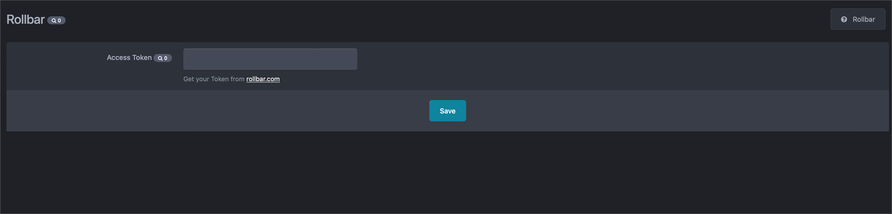

Error tracking and logging from IPS4 to Rollbar
================
  

Installation
------------
The preferred way to install this application is via the Marketplace LINK //TODO 

After the installation you'll find the settings in your ACP on the System => Integrations page.

Changelog:

2.0.0
- Moved the settings to an IPS Integrations
